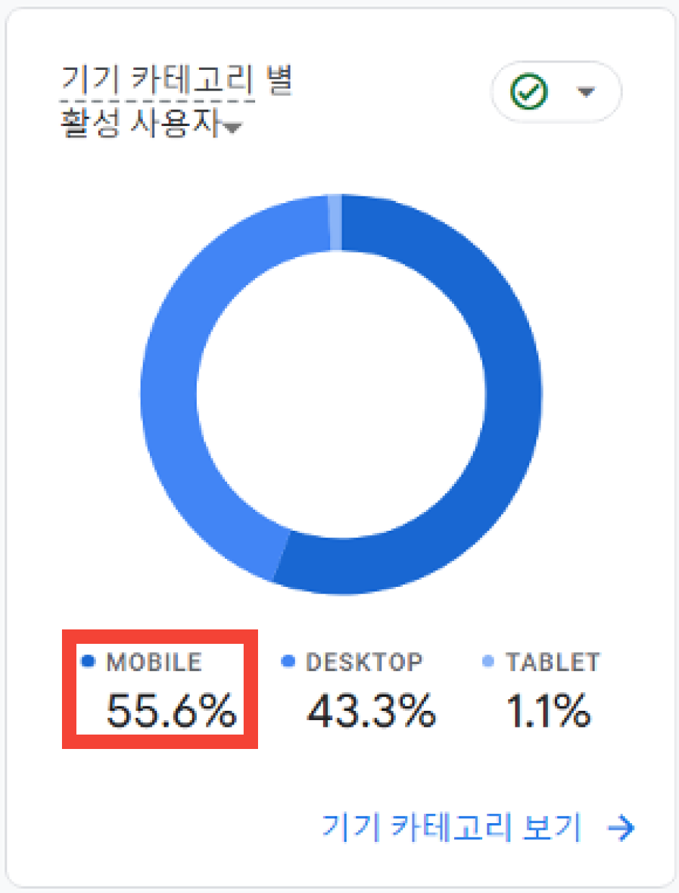
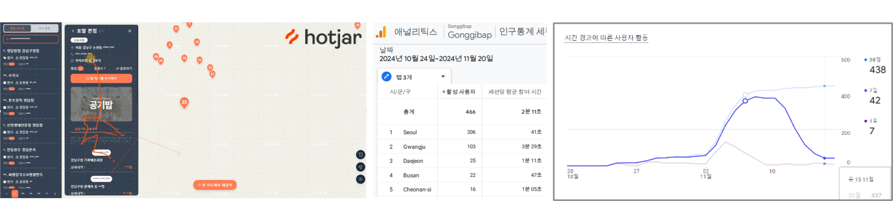

# 공기밥
공공기관이 찾는 로컬 찐 맛집! “**공기밥**”

공공기관의 업무추진비 데이터를 활용해 해당 지역의 맛집 정보를 제공하는 서비스

(삼성 청년SW아카데미 자율 프로젝트 **🏆우수상🏆**)

**배포 주소** : [https://gonggibap.co.kr](https://gonggibap.co.kr)

___

`SSAFY 11th 자율 PJT`

`개발기간: 24.10.14 ~ 24.11.21 (6주)`

### [프로젝트 전체 리드미](https://github.com/gonggibap)

# ✨ 주요기능

### 📌 공공기관 맛집 지도 기능

    - 공기밥은 업무추진비 데이터를 활용해 추출한 맛집을 지도를 통해 보여줍니다.
      - 마커 : 실제 위치를 확인할 수 있습니다.
      - 클러스터링 : 인접한 데이터를 그룹화 하여 요약
    - 음식점, 카페, 술집과 한식, 중식 등 카테고리별로 지도 데이터를 수정할 수 있습니다.

### 📌 맛집 상세정보 기능

    - 실제 업무추진비로 사용된 내역을 제공하여 사용자가 데이터를 직접 확인하고 믿을 수 있게 하였습니다.
    - 블로그 API를 통해 해당 맛집의 사용자 리뷰도 확인할 수 있습니다.
    - 사이트 내의 리뷰 서비스를 제공하고 있으며, 점수와 사진을 등록할 수 있습니다. 이때 유익한 리뷰의 사진 중 하나는 썸네일 사진으로 업데이트 됩니다.
    
### 📌 공기밥 익스텐션 기능
	- 카카오맵 웹에서 공기밥 서비스가 인증한 맛집을 표시하는 확장프로그램 제공합니다.
	- 크롬 익스텐션 스토어에서 익스텐션을 설치할 수 있습니다.

### 📌 편의 기능

    - 맛집 공유하기 : 공유 링크를 복사하여 카카오톡에 전송하면 해당 맛집의 썸네일 사진이 나오도록 구현하였습니다. 
    - 관심 맛집 : 로그인 이후 "내 지도에 추가하기" 버튼을 클릭시 나만의 맛집여지도를 만들 수 있습니다.
    - 다크 모드 : 사용자는 라이트모드/다크모드 를 선택하여 UI를 업데이트 할 수 있습니다.
    - 모바일 UI : 사용자는 서비스를 모바일 UI로도 이용할 수 있습니다. 이때, 제스처 기능 또한 제공됩니다.

# 💻 담당 역할

- 맛집 상세 정보 페이지 및 지도 연결
- 반응형 웹사이트 구현
- 구글 애널리틱스 설정 및 모니터링
- 공기밥 익스텐션

### 사용자 트래픽 분석

> 프로모션(링크드인, 인스타 등) 진행 후 MAU는 `330명`, 재방문자 수는 `47명` 로 증가

> 모바일 사용자의 비중이 높은 것을 확인 
> 모바일 UI/UX 개선으로 사용자 경험을 향상

- 페이지 리스트 sticky 상태 추가
- 모바일 환경 상세보기 화면에서 오른쪽 스와이프시 목록으로 이동
- 리뷰, 사용내역, 음식점 리스트
페이지 이동시 스크롤 최상단 이동
> 이외에도 사용자 피드백을 통한 UI/UX 개선
- 리뷰 삭제 시 확인 모달 구현
- 찜한 식당 목록과 함께 지도에 표시
- 찜한 식당 상세 조회시 같은 페이지에서 조회
- 사용 내역 상세 정보 토글 확인, 사용 내역
- 리뷰 한 페이지에 10 -> 5개로 수정 등

### Extension 개발

> 구글 애널리틱스와 핫자를 활용한 모니터링에서 이탈율이 높아짐을 확인

-> 이를 해결하고자 익스텐션 기획

- 공기밥 Extension 을 통해 카카오맵에서 공기밥 서비스에서 제공하는 맛집 정보 조회 가능
- 카카오맵에서 맛집 검색 시 나오는 공기밥 이모티콘을 클릭하거나 맛집 상세페이지에서 팝업으로 등장하는 `공기밥에서 방문 횟수 확인하기` 클릭 시 공기밥 서비스로 접속 가능하여 서비스의 접근성 향상 및 유입 유저수 증가   
1. 카카오맵 검색 화면

2. 카카오맵 음식점 상세페이지 화면

3. 공기밥 서비스 유입 화면

### 구현사항

 
📢 페이지 상세설명

 

 

 

# 🛠 기술 스택

 

### 기술 선정 이유
- Next.js : 서비스 운영을 목적으로 SSR과 메타 태그를 활용한 SEO 최적화를 위해 Next.js를 도입함
- Tailwind CSS : 모바일, 웹 플랫폼 지원을 위한 반응형 + 적응형 웹사이트를 구현하는데 장점이 있으며, 빠른 서비스 출시를 위해 개발 속도에 장점이 있는 Tailwind CSS 선정함

# 📚 배운점
- 프로젝트 설계의 중요성
    - 사이드 바를 통한 정보 제공을 하는 메인 페이지와 공유 링크로 접속하였을 때의 공유 페이지 두개로 구성
    - 메인 페이지가 하나의 페이지로 구성되어 있는데 전역 변수를 사용해도 괜찮은 가에 대한 고민
    - 결국 props drilling의 계층이 깊어지다 보니 관리 및 유지보수가 어려워진다는 것을 깨달음. 
- SEO 최적화
    - 시맨틱 태그, 메타 태그, ARIA 라벨로 웹 접근성 향상
    - Next 프레임워크와 SSR, CSR 등의 렌더링 방식에 대한 학습

# 🍚 공기밥 서비스

|    공기밥 웹 서비스    |    공기밥 Chrome 익스텐션    |
|:-----------------:|:-------------------------:|
|  |  |
| [🔗 사이트 방문하기](https://gonggibap.co.kr/) | [🔗 익스텐션 설치하기](https://chromewebstore.google.com/detail/%EA%B3%B5%EA%B8%B0%EB%B0%A5-extension-%EB%A7%9B%EC%A7%91-%EA%B2%80%EC%83%89-%EC%84%9C%EB%B9%84%EC%8A%A4/poifnfdoponfeneednggfmdoabddncdk?hl=ko&utm_source=ext_sidebar) |
